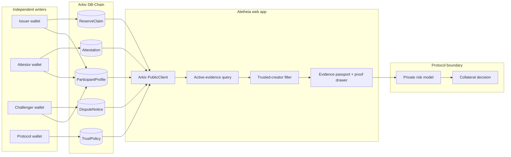
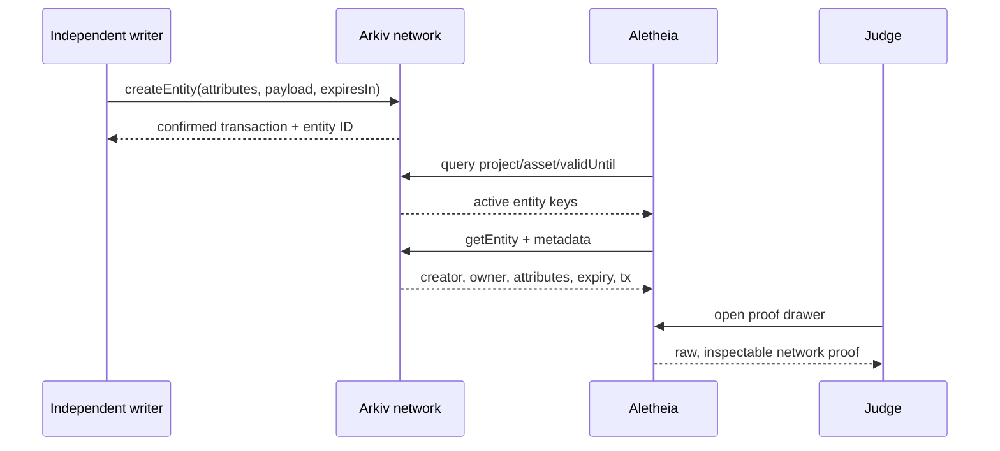

<div align="center">
  

  # Aletheia

  **Evidence, not verdicts.**

  A creator-verifiable, time-bounded disagreement graph for DeFi reserve evidence.

  [Live app](https://aletheia-self.vercel.app) · [Judge it in 60 seconds](#judge-this-in-60-seconds) · [Architecture](#architecture) · [Run locally](#setup)
</div>


> [!IMPORTANT]
> **What a judge should verify first:** open **View query**, inspect a record, and confirm the entity ID, immutable `$creator`, validity window, transaction hash, raw attributes, and network state. If Arkiv is unavailable, Aletheia fails closed. The separately activated fixture preview is visibly marked **NOT ARKIV** and never masquerades as network proof.

## One-line thesis

Aletheia lets DeFi risk teams compare independently authored reserve claims, corroborations, qualifications, and disputes without trusting one aggregator to control the conclusion.

## Problem

Reserve evidence is fragmented across issuer disclosures, assurance reports, PDFs, and internal protocol reviews. Risk teams need to answer a recurring question before admitting reserve-backed collateral: **what current evidence exists, who authored it, and where do credible reviewers disagree?**

A conventional dashboard can normalize that evidence, but it also becomes another trusted intermediary. Its operator can omit an adverse opinion, relabel an author, revise a record without an independently verifiable trace, or leave stale evidence in the active view.

## Why centralized scoring fails

A single proprietary score hides the exact information a risk team needs to inspect:

- different evidence methodologies are not interchangeable;
- a proof-of-reserves snapshot may omit liabilities, legal rights, or temporary asset movements;
- reasonable experts can reach different conclusions from the same claim; and
- each lending protocol has its own trusted reviewers and risk thresholds.

Aletheia therefore preserves disagreement. A corroboration, qualification, or dispute is a separately authored entity—not an input that disappears inside an operator-owned score.

## Solution

The product is an evidence passport for reserve-backed assets:

1. an issuer publishes a compact `ReserveClaim` linked to the full evidence by hash and pointer;
2. independent writers append `Attestation` or `DisputeNotice` entities;
3. each protocol publishes its own `TrustPolicy` for accepted creator wallets and freshness thresholds;
4. Aletheia queries only current entities and exposes every proof field in the interface; and
5. the protocol keeps its private risk model and final collateral decision off Arkiv.

The product never claims an asset is safe. It makes current evidence and disagreement independently inspectable.

## Why Arkiv is necessary

| User-visible promise | Operator-controlled database | Arkiv-backed design |
|---|---|---|
| Authorship | The application asserts who wrote a record | `$creator` is read from Arkiv metadata |
| Disagreement | An operator can suppress an adverse opinion | Each opinion is an independent, append-only entity |
| Freshness | A cron job decides what remains active | The active query filters `validUntil`, while Arkiv expiry prunes stale state |
| Proof | A UI row can be fabricated | Entity ID, owner, attributes, expiry block, and transaction hash are inspectable |
| Trust | The aggregator owns the score | Each protocol owns its `TrustPolicy` |

Replacing Arkiv with Postgres would preserve storage, but break the provenance and multi-writer guarantees that define the product.

## Data model

Every entity uses `project = "aletheia"`. Relationships use explicit `assetId` and `claimId` attributes. Range-filtered values are integer numeric attributes: timestamps in seconds, money in cents, and ratios in basis points.

| Entity | Purpose | Key attributes | Lifetime |
|---|---|---|---|
| `ReserveClaim` | Issuer reserve assertion | `assetId`, `claimId`, `issuerId`, `methodologyId`, `evidenceHash`, `observedAt`, `validUntil`, `reserveUsdCents`, `liabilityUsdCents`, `coverageBps` | Evidence-defined; commonly 8–35 days |
| `Attestation` | Independent opinion | `assetId`, `claimId`, `methodologyId`, `stance`, `confidenceBps`, `coverageBps`, `validUntil` | Never longer than its parent claim |
| `DisputeNotice` | Queryable adverse evidence | `assetId`, `claimId`, `reasonCode`, `evidenceHash`, `severityTier`, `validUntil` | Seven days or remaining claim life |
| `TrustPolicy` | Protocol-specific creator policy | `protocolId`, `assetId`, `trustedCreator`, `minCoverageBps`, `maxAgeSec`, `minCorroborations`, `validUntil` | 90 days |
| `ParticipantProfile` | Public writer metadata | `participantId`, `role`, `displayName`, `credentialHash`, `status` | One year |

## Real Arkiv integration

The browser adapter in `app/arkiv-client.ts` uses the official `@arkiv-network/sdk` public client. Its runtime path is:

1. read network time from the configured Arkiv chain;
2. query `project = aletheia`, the selected `assetId`, and `validUntil > networkNow`;
3. fetch each matching entity and its immutable metadata;
4. derive creator, owner, expiry block, and creation transaction hash from network data; and
5. render active evidence without silently substituting local fixtures.

The seed script in `scripts/seed-arkiv.ts` uses three independent wallets, confirms each write, reads it back, verifies the creator, and only then writes `public/arkiv-proof-manifest.json`. Seed private keys are never written to the manifest or browser bundle.

> [!NOTE]
> Arkiv's Braga network was retired on August 12, 2026. Arkiv currently documents limited devnet access through August and a public testnet planned for September. This repository contains the production integration and opt-in live test, but cannot truthfully claim a newly seeded public dataset until a live RPC, chain ID, explorer, and funded writer keys are supplied.

## Creator provenance

Issuer, attestor, challenger, and protocol policy writes are made by separate wallets. The UI never accepts a payload field as creator proof; it reads `$creator` from Arkiv entity metadata. A trust filter compares that immutable address with the active protocol policy.

The fixture preview uses obviously synthetic addresses and a persistent **NOT ARKIV** warning. It exists only so reviewers can understand the interaction while the public network is unavailable.

## Disagreement model

Aletheia never updates one record to change a verdict. New evidence appends a new entity:

```text
ReserveClaim
  ├── Attestation: corroborate
  ├── Attestation: qualify
  └── DisputeNotice: dispute
```

All branches share `claimId`, retain distinct `$creator` values, and remain visible until their own validity windows end. A user may filter the view, but the query inspector always reports the current network result set.

## Freshness / expiration

`validUntil` is part of both the entity attributes and the active predicate. The seed script also supplies Arkiv's entity-expiration value. Child evidence is rejected if its lifetime exceeds the parent claim.

`ReserveClaim`, `Attestation`, and `DisputeNotice` entities are never extended to simulate freshness. A reassessment creates a new, separately signed entity. `TrustPolicy` may be extended only after the protocol reapproves its trusted creators and thresholds. `ParticipantProfile` may be renewed after its credential is renewed; renewal signals continued participation, not endorsement.

Arkiv documentation says expired entity data is pruned from live state. Aletheia does **not** claim that an expired entity remains directly queryable. Instead, the proof manifest retains the confirmed creation transaction reference so a reviewer can inspect the historical write after the live entity leaves the active query.

## Core query contract

### 1. Active evidence for an asset

```text
eq(project, "aletheia")
+ eq(assetId, selectedAsset)
+ gt(validUntil, networkNow)
```

The browser groups the current claim and opinions by type, filters immutable `$creator` values against the selected protocol policy, and uses cursor pagination with bounded client-side ordering where needed.

### 2. Active disputes for a claim

```text
eq(project, "aletheia")
+ eq(type, "dispute_notice")
+ eq(claimId, selectedClaim)
+ gt(validUntil, networkNow)
```

A count query drives the disagreement badge; records are fetched only when the analyst opens the dispute view.

### 3. Current protocol trust policy

```text
eq(project, "aletheia")
+ eq(type, "trust_policy")
+ eq(protocolId, selectedProtocol)
+ eq(assetId, selectedAsset)
+ gt(validUntil, networkNow)
```

The newest active policy supplies trusted creator wallets, freshness bounds, coverage thresholds, and corroboration requirements. No query depends on joins, push events, triggers, or latency-sensitive execution.

## Adoption path

- **First user:** a lending-protocol risk analyst deciding whether a stablecoin or tokenized real-world asset should enter or remain in a collateral market.
- **First 100 entities:** the protocol's ingestion worker publishes compact issuer disclosures; its own analysts and risk agents append signed opinions and disputes. External attestors are optional at launch.
- **Activation event:** the analyst compares one current issuer claim with at least one trusted independent opinion before the collateral review proceeds.
- **Single-user starting mode:** one protocol gets immediate value by combining issuer evidence with its own internal risk opinion; outside writers improve coverage later without being required for day-one usefulness.
- **Distribution wedge:** begin as the inspectable evidence appendix to an existing collateral-review memo, then let other protocols reuse the same public entities with their own `TrustPolicy`.

## Deliberate differentiation

The obvious product is a proof-of-reserves dashboard with one proprietary score. Aletheia instead preserves an append-only disagreement graph and consumer-owned trust policies. Corroborations, qualifications, and disputes remain separately authored entities; no central writer owns the conclusion.

## Weekend MVP

One USDC passport, one issuer claim, two independently authored attestations, one dispute, one protocol policy, the three predicates above, visible proof metadata, and expiry changing the active result. No collateral execution, universal auditor governance, private-data storage, or proprietary safety score.

## Architecture





## Judge this in 60 seconds

1. Open the [live app](https://aletheia-self.vercel.app) and read the network-status badge.
2. Click **View query**. Confirm the project namespace, asset, network time, validity predicate, result count, and returned entity IDs.
3. Open an evidence row. Confirm entity ID, `$creator`, owner, validity window, expiry block, transaction hash, and raw attributes.
4. Select **trusted** and then **dispute**. The views filter records; no favorable or adverse record is overwritten.
5. Switch to **transaction history**. Confirm that expired live state is not presented as active evidence.
6. If the network is unavailable, activate the explicitly labelled fixture preview and verify that every proof surface says **NOT ARKIV**.

## Live demo

**URL:** [aletheia-self.vercel.app](https://aletheia-self.vercel.app)

## Setup

Requirements: Node.js `>=22.13.0` and npm.

```bash
git clone https://github.com/0xNexuz/aletheia-arkiv.git
cd aletheia-arkiv
npm install
cp .env.example .env.local
npm run dev
```

Open `http://localhost:3000`.

## Environment variables

Public browser configuration:

| Variable | Required | Purpose |
|---|---:|---|
| `VITE_ARKIV_RPC_URL` | yes for live mode | Arkiv JSON-RPC endpoint |
| `VITE_ARKIV_CHAIN_ID` | yes for live mode | Numeric Arkiv chain ID |
| `VITE_ARKIV_NETWORK_NAME` | recommended | Human-readable network label |
| `VITE_ARKIV_EXPLORER_URL` | recommended | Base explorer URL for proof links |
| `VITE_ALETHEIA_ASSET_ID` | optional | Defaults to the demo asset namespace |
| `VITE_ALETHEIA_PROTOCOL_ID` | optional | Defaults to the demo protocol namespace |

Server/local seed configuration:

| Variable | Required | Purpose |
|---|---:|---|
| `ARKIV_RPC_URL` | yes | Arkiv writer RPC |
| `ARKIV_CHAIN_ID` | yes | Numeric chain ID |
| `ARKIV_NETWORK_NAME` | optional | Manifest network label |
| `ARKIV_EXPLORER_URL` | recommended | Proof-link base URL |
| `ARKIV_ISSUER_PRIVATE_KEY` | yes | Issuer writer; server/local only |
| `ARKIV_ATTESTOR_PRIVATE_KEY` | yes | Independent attestor; server/local only |
| `ARKIV_CHALLENGER_PRIVATE_KEY` | yes | Challenger writer; server/local only |
| `ALETHEIA_SEED_ID` | yes | Unique seed namespace; duplicate seeds are rejected |
| `ALETHEIA_ASSET_ID` | optional | Asset namespace |
| `ALETHEIA_PROTOCOL_ID` | optional | Protocol namespace |
| `ALETHEIA_EXPIRY_PROBE_SECONDS` | optional | Short-lived record for the live expiry test |

Never expose writer private keys through `VITE_` variables or commit them to Git.

## Testing

```bash
npm test
npm run lint
npm run arkiv:seed
ARKIV_LIVE_TEST=1 npm run test:arkiv:live
npm run build:vercel
```

The unit suite verifies claim/attestation/dispute mapping, distinct creators, active-versus-expired behavior, transaction-backed historical references, malformed and duplicate write rejection, query constraints, and fail-closed network behavior.

## REAL vs DEMO

| Surface | Classification | How to verify |
|---|---|---|
| Arkiv SDK adapter | **REAL CODE PATH** | Inspect `app/arkiv-client.ts` |
| Multi-wallet seed and confirmation | **REAL CODE PATH** | Inspect and run `scripts/seed-arkiv.ts` |
| Live query/entity proof drawer | **REAL when configured** | Check the UI network badge and explorer links |
| `public/arkiv-proof-manifest.json` | **UNVERIFIED until seeded** | Must contain confirmed IDs and transactions from the seed run |
| Fixture preview | **DEMO / NOT ARKIV** | Persistent warning and synthetic identifiers |
| Final collateral decision | **OUT OF SCOPE** | Remains inside the consuming protocol |

No important behavior silently falls back to hardcoded evidence. Missing or failed network configuration produces an unavailable/error state; fixtures require an explicit user action.

## Limitations

- Arkiv has no open public network at the time of this update; live proof requires limited devnet credentials or the next public testnet.
- Evidence provenance does not prove complete solvency or validate the underlying report.
- Public evidence may be scraped; private inputs and risk calculations stay off Arkiv.
- Arkiv expiry prunes live entity data, so Aletheia references the creation transaction for historical inspection rather than promising historical entity queries.
- The browser bundle is read-only. Production writes belong in a secured service or controlled seed process.
- Automated collateral admission, liquidation, staking, auditor governance, and ZK proof generation are deliberately excluded.

## Security

- Private keys are accepted only by the local/server seed script.
- The browser uses a public client and cannot write.
- Duplicate seed namespaces fail before any write.
- Seeded entities are read back and creator-checked after confirmation.
- Child validity cannot exceed the parent claim.
- Creator trust is matched against Arkiv metadata, never user-controlled payload text.
- Raw private reports, KYC, bank statements, and secret model inputs are never stored on Arkiv.

## Future work

- seed and publish the proof manifest when Arkiv public testnet becomes available;
- add cursor pagination for larger evidence sets;
- support multiple protocol policies and asset namespaces;
- add report-hash verification and content-addressed evidence links;
- create a secured writer service with wallet isolation and audit logging; and
- evaluate ZK attestations for private reserve components without exposing witnesses.


## Ready-to-paste Tally answers

The answers below map directly to the official form and stay within its published limits. Complete the personal/team fields, add your recorded video URL, review the legal confirmations, complete CAPTCHA, and submit before **August 31, 2026 at 23:59 UTC**.

### Idea name

> Aletheia — Reserve-Evidence Disagreement Graph

### One-line pitch

> Aletheia gives DeFi risk teams a creator-verifiable, self-expiring graph of reserve claims, independent attestations, and disagreements before they approve reserve-backed collateral.

### Problem and user

> Risk teams at lending protocols evaluate stablecoins and tokenized RWAs using evidence fragmented across issuer pages, assurance reports, PDFs, and internal reviews. A centralized aggregator can omit adverse opinions, mislabel authors, silently revise normalized records, or keep stale evidence visible. Aletheia serves the analyst deciding whether an asset should enter or remain in a collateral market. The activation event is simple: compare one current issuer claim with a trusted independent opinion and immediately see corroboration, qualification, or dispute before collateral review proceeds. Weekly disclosures and monthly assurance reports make this a recurring workflow; proof-of-reserves snapshot limitations make visible methodology and disagreement essential.

### First slice

> Weekend slice: one USDC passport with one issuer ReserveClaim, two independently authored Attestations, one DisputeNotice, and one protocol TrustPolicy. The analyst inspects creator and transaction proof, filters by trusted creators, counts active disputes, and watches expired evidence leave active results. The first 100 entities come from a protocol ingestion worker publishing issuer disclosures plus its own analysts or risk agents appending opinions, so no external network effect is required. The main unknown is whether teams will publish internal opinions. Excluded: collateral execution, liquidation, universal auditor governance, private reports, ZK generation, and a proprietary safety score.

### Entities and attributes

> Every entity has project="aletheia" and explicit assetId/claimId relationships. ReserveClaim: assetId, claimId, issuerId, methodologyId, evidenceHash, status; observedAt, validUntil, reserveUsdCents, liabilityUsdCents, coverageBps. Attestation: assetId, claimId, methodologyId, stance, status; observedAt, validUntil, confidenceBps, coverageBps. DisputeNotice: assetId, claimId, reasonCode, evidenceHash, status; severityTier, observedAt, validUntil. TrustPolicy: protocolId, assetId, trustedCreator, status; minCoverageBps, maxAgeSec, minCorroborations, validUntil. ParticipantProfile: participantId, role, displayName, credentialHash, status. Money uses integer cents, ratios use basis points, timestamps use integer seconds, and severity is an integer tier. Multi-party contributions are append-only, and creator identity comes from immutable Arkiv $creator metadata—not a payload field.

### Queries

> 1) Active evidence: eq(project,"aletheia") + eq(assetId,X) + gt(validUntil,now). Paginate with cursors; group by type and filter $creator against the protocol policy. 2) Active disputes: eq(project,"aletheia") + eq(type,"dispute_notice") + eq(claimId,C) + gt(validUntil,now). Count for the badge; fetch records on open. 3) Current policy: eq(project,"aletheia") + eq(type,"trust_policy") + eq(protocolId,P) + eq(assetId,X) + gt(validUntil,now). Use the newest active policy for accepted creators and thresholds. Result sets are narrow and namespaced; bounded client-side ordering is used where needed. Nothing depends on joins, server-side custom ordering, push events, triggers, or execution-path latency.

### Expiry, extension, and ownership

> ReserveClaim lifetime follows its evidence: 8 days by default for weekly disclosure or up to 35 days for monthly assurance. Attestation never outlives its parent claim. DisputeNotice lasts 7 days or the claim's remaining life, whichever is shorter. TrustPolicy lasts 90 days; ParticipantProfile lasts one year. ReserveClaim, Attestation, and DisputeNotice are never extended to imitate freshness—a reassessment creates a fresh signed entity. TrustPolicy may be extended only after the protocol reapproves creators and thresholds; profile renewal signals participation, not endorsement. Issuers, attestors, challengers, and protocols write with separate wallets. Arkiv expiry prunes live entity state; Aletheia keeps only the confirmed creation-transaction reference for historical inspection and never presents expired evidence as active.

### Why Arkiv?

> With Postgres and a cron job, Aletheia's operator could hide an adverse opinion, impersonate or relabel an attestor, rewrite normalized evidence without an independently verifiable trace, or keep an expired claim in the active surface. That breaks the product's promise. Arkiv makes immutable $creator provenance, independent multi-writer entities, queryable typed attributes, confirmed transaction references, and protocol-enforced expiry visible to the user. Aletheia exposes competing signed claims and lets each protocol own its TrustPolicy; it never asks users to trust Aletheia's database or one proprietary score.

### What stays off Arkiv?

> Raw reports, bank statements, account details, identity/KYC data, large files, ZK witnesses, secret inputs, proprietary risk calculations, and the final collateral decision. Trading, oracles, liquidation, collateral enforcement, and every latency-sensitive execution step also remain off Arkiv. Arkiv receives only compact public facts, hashes, verifiable pointers, creator-owned opinions, relationships, and freshness metadata.

### Supporting links and remaining personal action

- Track: **DeFi**
- Product/mockup: https://aletheia-self.vercel.app
- Repository: https://github.com/0xNexuz/aletheia-arkiv
- Ideathon MCP used: **Yes**
- Arkiv SDK/docs used: **Yes**
- Add: your video URL, optional X post, community/how-heard answers, team size/location, legal names, emails, handles, EVM wallet, required consents, and CAPTCHA.


---

Built by **Magnum Inc.** for the Arkiv Ideathon DeFi track.
