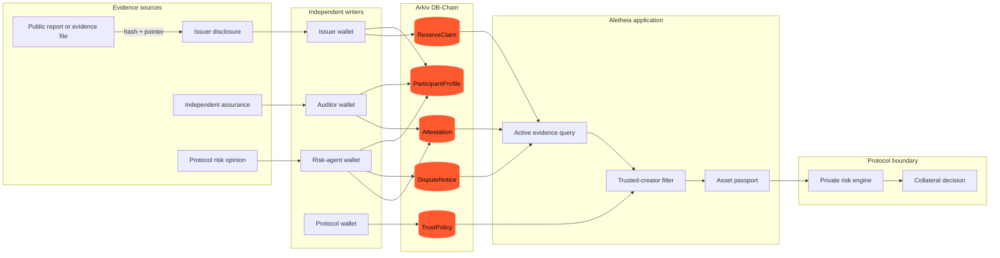
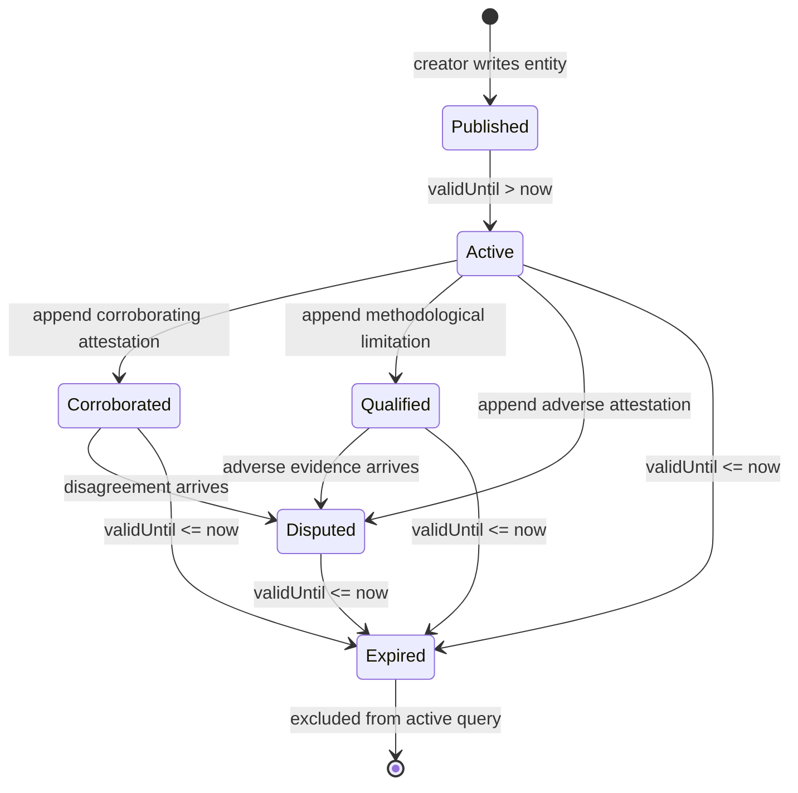

<div align="center">
  

  # Aletheia

  **Evidence, not verdicts.**

  A creator-verifiable, self-expiring graph of reserve claims, independent attestations, and visible disagreement for DeFi risk teams.

  [Live demo](https://aletheia-self.vercel.app) · [Architecture](#architecture) · [Demo guide](#90-second-demo) · [Local setup](#local-development)
</div>


## What Aletheia is

Aletheia is an interactive product concept for the **DeFi track of the Arkiv Ideathon**. It helps lending-protocol risk teams evaluate reserve-backed collateral—such as stablecoins and tokenized real-world assets—without relying on one operator-controlled safety score.

Instead, Aletheia presents a queryable evidence graph:

- issuers publish time-bounded reserve claims;
- auditors and risk agents publish independently authored attestations;
- attestations explicitly corroborate, qualify, or dispute a claim;
- each protocol defines the creator wallets and thresholds it trusts; and
- expired evidence automatically leaves the active query surface.

The interface does **not** claim that an asset is safe. It makes every current claim, author, limitation, and disagreement independently inspectable.

> [!IMPORTANT]
> This repository is the production-hosted interactive ideathon demo. Its records are clearly labelled illustrative. It demonstrates the complete Arkiv entity model, query behavior, expiration semantics, and judge-facing workflow; it does not claim a live network deployment or automated collateral execution.

## The problem

Reserve evidence is fragmented across issuer pages, assurance reports, PDFs, and internal risk reviews. A conventional aggregator becomes another trusted intermediary: it can decide which opinions appear, silently revise normalized data, misrepresent an author, or leave stale evidence visible.

That creates three specific risks:

1. **Provenance risk** — users must trust the aggregator's account of who produced an opinion.
2. **Censorship risk** — adverse evidence can be hidden or de-ranked.
3. **Freshness risk** — expiry is an application promise instead of a protocol-level property.

## The product

The current demo centers on one illustrative USDC evidence passport. It lets a judge:

1. inspect an issuer claim and two independently authored opinions;
2. see `$creator`, stance, coverage, and observation time on every record;
3. filter evidence using a protocol-owned trusted-creator policy;
4. isolate an adverse opinion without deleting favorable evidence;
5. advance time by ten days and watch stale evidence leave the active result; and
6. inspect the Arkiv data contract and database counterfactual.

## Why Arkiv is load-bearing

| Product promise | Operator database | Arkiv-backed design |
|---|---|---|
| Verifiable authorship | The platform asserts the author | Immutable `$creator` is visible on every write |
| Visible disagreement | The operator can hide an adverse record | Opinions remain separately authored, append-only entities |
| Reliable freshness | A cron job decides what looks active | Entity expiration governs the active query surface |
| Inspectable history | Normalized data can be silently rewritten | Every published record has verifiable provenance |
| Consumer-owned trust | The aggregator owns the score | Each protocol publishes its own `TrustPolicy` |

Replacing Arkiv with Postgres would preserve storage, but break the user-visible guarantees that make Aletheia useful.

## Architecture



### Evidence lifecycle



Expiration removes a record from the active application view; it does not erase historical chain data.

## Arkiv data contract

Every entity is namespaced with `project = "aletheia"`. Relationships use explicit shared `assetId` and `claimId` keys. Multi-party opinions are append-only so one writer never replaces another writer's state.

| Entity | Purpose | Important attributes | Lifetime |
|---|---|---|---|
| `ReserveClaim` | Issuer's compact reserve assertion | `assetId`, `claimId`, `issuerId`, `methodologyId`, `evidenceHash`, `observedAt`, `validUntil`, `reserveUsdCents`, `liabilityUsdCents`, `coverageBps` | Evidence-defined; normally 8–35 days |
| `Attestation` | Independent opinion about a claim | `assetId`, `claimId`, `methodologyId`, `stance`, `status`, `observedAt`, `validUntil`, `confidenceBps`, `coverageBps` | Never longer than its parent claim |
| `DisputeNotice` | Compact, queryable adverse evidence | `assetId`, `claimId`, `reasonCode`, `evidenceHash`, `severityTier`, `observedAt`, `validUntil` | Seven days or remaining claim life |
| `TrustPolicy` | Protocol-specific creator and freshness policy | `protocolId`, `assetId`, `trustedCreator`, `minCoverageBps`, `maxAgeSec`, `minCorroborations`, `validUntil` | 90 days |
| `ParticipantProfile` | Public participant metadata | `participantId`, `role`, `displayName`, `credentialHash`, `status` | One year |

Money is stored as integer cents, ratios as basis points, timestamps as integer seconds, and severity as an integer tier. This keeps range predicates deterministic.

### Core predicates

```text
# Active attestations for an asset
eq(project, "aletheia")
+ eq(type, "attestation")
+ eq(assetId, X)
+ gt(validUntil, now)

# Active disputes for a claim
eq(type, "attestation")
+ eq(claimId, X)
+ eq(stance, "dispute")
+ gt(validUntil, now)

# Current protocol trust policy
eq(type, "trust_policy")
+ eq(protocolId, P)
+ eq(assetId, X)
+ gt(validUntil, now)
```

Results are cursor-paginated. Aletheia filters `$creator` against the selected protocol's policy and performs only bounded client-side ordering where required.

## What stays off Arkiv

- raw assurance reports, bank statements, large files, and private account data;
- KYC material, secret inputs, or ZK witnesses;
- proprietary risk calculations and the final admission decision;
- price oracles, trading, liquidation, collateral enforcement, and other latency-sensitive execution; and
- any claim that evidence alone proves complete solvency.

Arkiv receives compact public facts, hashes, evidence pointers, ownership, timestamps, and coordination state.

## Repository status

| Surface | Status |
|---|---|
| Responsive product experience | Complete |
| Evidence filtering and dispute view | Complete |
| Time-advance / expiry demonstration | Complete |
| Five-frame judge walkthrough | Complete |
| Arkiv entity and predicate specification | Complete |
| Production Vercel deployment | Live |
| Live Arkiv network writes | Intentionally not claimed |
| Automated collateral admission | Out of scope |

## Technology

- React 19 and TypeScript
- vinext and Vite
- Tailwind CSS processing with a bespoke editorial design system
- Cloudflare Worker-compatible build output
- Static Vercel export for the public demo
- Node's built-in test runner and ESLint

## Local development

### Requirements

- Node.js `>=22.13.0`
- npm

### Run locally

```bash
git clone https://github.com/0xNexuz/aletheia-arkiv.git
cd aletheia-arkiv
npm install
npm run dev
```

Open `http://localhost:3000`.

### Validate

```bash
npm run lint
npm test
```

### Build the public Vercel export

```bash
npm run build:vercel
```

This generates the vinext production build and exports the root experience to `dist/client/index.html` for Vercel's static delivery.

## Project structure

```text
app/
  globals.css          visual system, responsive states, and motion
  layout.tsx           metadata, social cards, and favicon
  page.tsx             interactive evidence passport and narrative
public/
  favicon.png          browser icon
  hero-figure.png      transparent particle figure
  logo-mark.png        Aletheia brand mark
  og.png               social preview and visual manifesto
scripts/
  export-vercel.mjs    production static-export adapter
tests/
  rendered-html.test.mjs
vercel.json            Vercel production configuration
```

## 90-second demo

### Click path

1. Open [aletheia-self.vercel.app](https://aletheia-self.vercel.app).
2. Introduce the one-line promise from the hero.
3. Click **Inspect the USDC passport**.
4. Point out the three stances and visible `$creator` values.
5. Click **trusted**, then **dispute**.
6. Click **+10D** and show the empty active-evidence state.
7. Click **Return to today**.
8. Show the five Arkiv entities and active-evidence predicate.
9. Contrast Postgres with Arkiv.
10. Select walkthrough frame **05** and deliver the closing line.

### Narration

**0–10 seconds — Hook**

> This is Aletheia—Greek for truth or unconcealment. It gives DeFi risk teams a verifiable view of reserve evidence without pretending to manufacture one universal safety score.

**10–25 seconds — Problem**

> Reserve evidence currently lives across issuer pages, assurance reports, PDFs, and private risk reviews. An ordinary aggregator controls which opinions remain visible and when evidence is considered stale.

**25–42 seconds — Product**

> Here is one illustrative USDC evidence passport. The issuer disclosure, independent assurance, and protocol risk opinion remain separate records. Every opinion exposes its own creator wallet, stance, coverage, and observation time.

**42–55 seconds — Trust and disagreement**

> A protocol can apply its own trusted-creator policy. Selecting trusted keeps the issuer and independent assurance. Selecting dispute reveals the adverse risk opinion without deleting or overriding favorable records.

**55–67 seconds — Demo moment**

> Freshness is part of the data contract. I will advance ten days. Every active record expires, and the passport becomes insufficient—not because Aletheia changed a score, but because stale evidence automatically left the active query surface.

**67–79 seconds — Technical mechanism**

> Underneath are five append-only Arkiv entities: reserve claims, attestations, disputes, trust policies, and participant profiles. Shared asset and claim IDs keep the evidence directly queryable.

**79–90 seconds — Counterfactual and close**

> With Postgres, the operator can hide an adverse opinion, relabel its author, or keep stale evidence active. Arkiv makes creator identity, provenance, and expiration load-bearing. Aletheia does not decide whether an asset is safe—it makes every current claim and disagreement independently checkable.

## Principal risks and mitigations

| Risk | Mitigation |
|---|---|
| Open-attestor spam | Each consumer filters immutable creator wallets through its own `TrustPolicy` |
| Evidence mistaken for solvency proof | Show methodology and limitations; never collapse evidence into a universal score |
| Cold start | One protocol can combine issuer data with its own internal risk opinion |
| Shared-database scale | Namespace and paginate narrow queries by project, asset, claim, and protocol |
| Public scraping | Treat public reuse as distribution; keep private calculations off Arkiv |
| Expired child evidence | An opinion cannot remain active beyond the referenced claim |

## MVP boundary

The demo intentionally excludes live collateral admission, liquidation, universal auditor governance, staking, ZK-proof generation, proprietary safety scores, and a full stablecoin registry. These features would obscure the central proof: independently authored evidence, consumer-owned trust, and time-bounded queryability.

## Brand

The mark is the **Unconcealed A**: two opening evidence brackets surrounding an orange provenance graph. It represents truth becoming inspectable without a central party controlling the conclusion.

---

Built for the Arkiv Ideathon DeFi track. Aletheia means **truth** or **unconcealment**.
